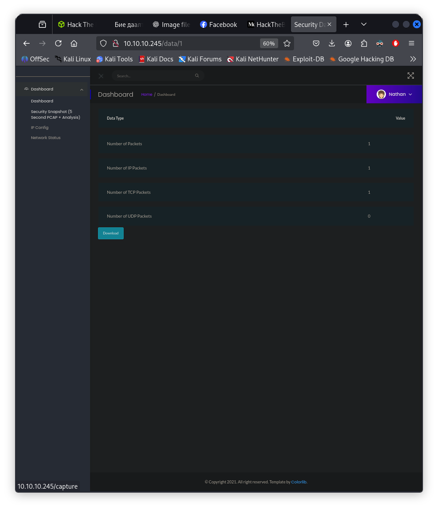

# Бие даалт – Тайлан

## Machine 01 — <Cap, IP:10.10.10.245>

## Энэ бүх даалгаваруудыг хийхээс өмнө target machine тай нэг сүлжээнд орох шаардлагатай.Тиймээс openvpn ашиглана нэг сүлжээнд байгаа юм шиг болгосон.

### 1) How many TCP ports are open? Hint:Scan the host with nmap.

    3

### 2) After running a "Security Snapshot", the browser is redirected to a path of the format /[something]/[id], where [id] represents the id number of the scan. What is the [something]?

    data

### 3) Are you able to get to other users' scans?

    yes

### 4) What is the ID of the PCAP file that contains sensative data?

    0

### 5) Which application layer protocol in the pcap file can the sensetive data be found in?

    ftp

### 6) We've managed to collect nathan's FTP password. On what other service does this password work?

    ssh

### 7) Submit the flag located in the nathan user's home directory.

    32267627d86088eb79f58dfb5d211b9d

### 8) What is the full path to the binary on this machine has special capabilities that can be abused to obtain root privileges?

    /usr/bin/python3.8

### 9)Submit the flag located in root's home directory.

    bbf65451187ab61533044698c36821fd
