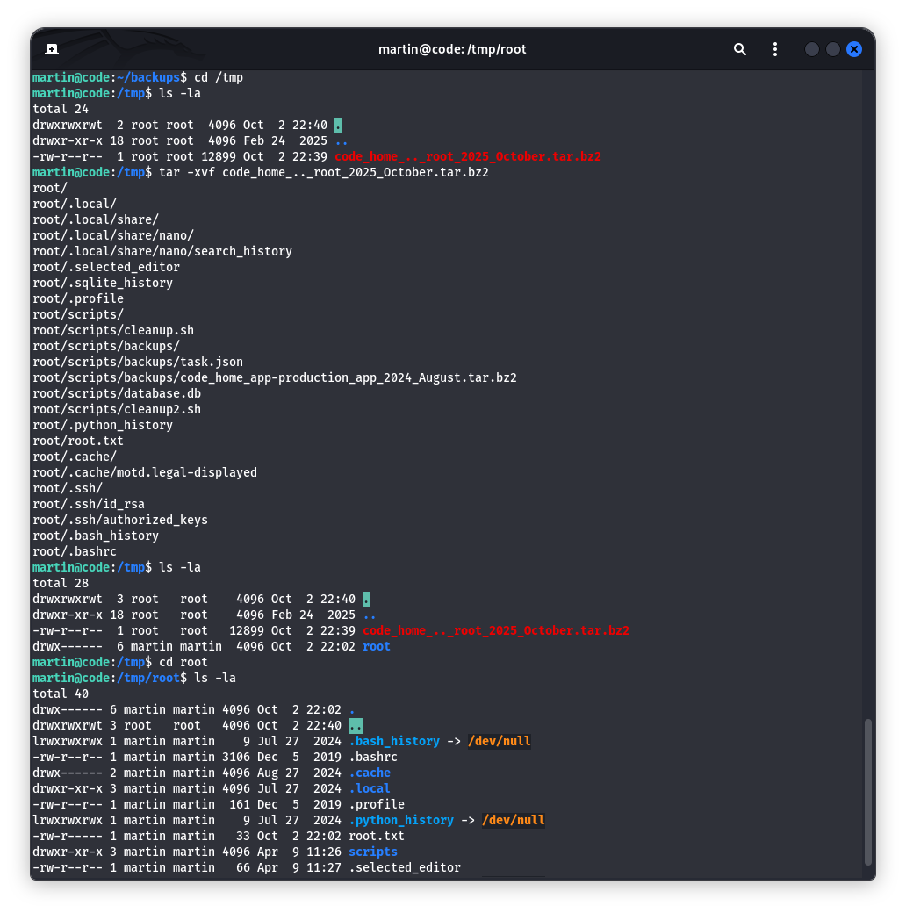

# Бие даалт – Тайлан

## Machine 05 — <Code, IP:10.10.11.23>

### 1) Nmap

### 2.) execute commands in sandbox

### 3.) found out.

### 4.) Python “Code Editor” sandbox: хориглосон түлхүүр үгийг bypass хийсэн.

### 5.) Гүйцэтгэлийг батлах: nc руу дамжуулсан

### 6.) reverse shell хийж холболт үүсгэв.

### 7.) Listening

### 8.) user flag.txt

### 9.) SQLite: аппын хэрэглэгч, hash-уудыг харсан.

### 10.) Crack

### 11.) Жинхэнэ хэрэглэгч рүү үсэрсэн

### 12.) скриптээр root хүрэх шанс

### 13.) task.json харав

### 14.) backy.sh харав

### 15.) task.json-оо file аа өөрчиллөв.

### 16.) sudo /usr/bin/backy.sh ~/backups/task.json

### 17.) Бэлгийг задлах: root-ийн гэрийг авчээ

### 18.) ssh/id_rsa-г хуулж root.key болгосон

# Дүгнэлт

### Эхлэл: 22/SSH, 5000/Gunicorn дээр “Python Code ExXditor” ил.

### Foothold (RCE): Кодын редактор нь түлхүүр үгнүүдийг л хориглосон, харин Python-ийн object graph-аар (**subclasses** → **globals** → sys.modules → os.system) тойрч RCE авсан. Гаралтыг UI буцаадаггүй тул Netcat руу чиглүүлж гүйцэтгэлийг баталгаажуулсан, дараа нь /dev/tcp reverse shell авч app-production болгон ажиллуулсан.

### Итгэмжлэл задлалт: App-ын database.db (SQLite) доторх хэрэглэгчдийн unsalted MD5 hash-уудыг hashcat -m 0-оор задлаад development:development, martin:nafeelswordsmaster илэрсэн. Нууц үг дахин ашигласнаар martin руу SSH орсон.

### Эрх нэмэгдүүлэлт: sudo -l дээр NOPASSWD: /usr/bin/backy.sh илэрсэн

# Кибер халдлагыг сөрөн тэсвэрлэх зөвлөмж

# Веб апп ба sandbox хатууруулалт

### Жинхэнэ sandbox: Контейнерт (namespace, cgroup) тусгаарлаж, сүлжээний гаралт хориглох, read-only FS, noexec mount, seccomp/AppArmor профайл.

### Суудогийн эрх: NOPASSWD: backy.sh-ийг цуцлах
