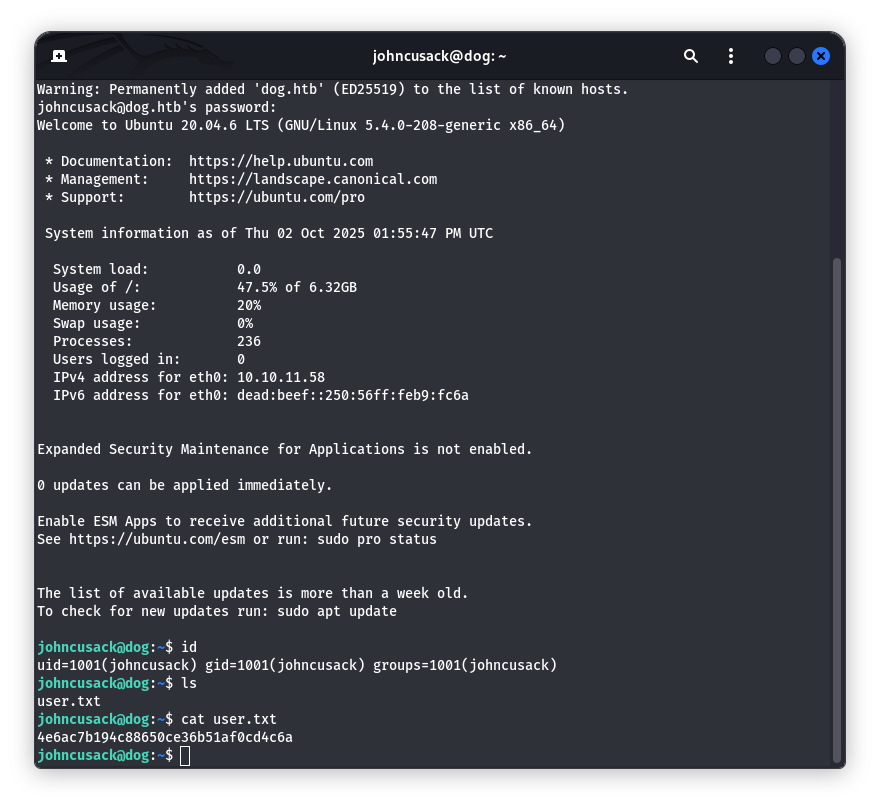

# Бие даалт – Тайлан

## Machine 05 — <Dog, IP:10.10.11.23>

### 1)

### Порт хайлт

### 22/ssh, 80/http илэрнэ. HTTP дээр Apache 2.4.41, Backdrop CMS баннер гарна.

### 2)

### .git ыг git dumper ашиглана brute force хийж clone хийсэн.

### 3)

### settings.php-оос DB credential авах

### 4)

### 5)

### Backdrop-ийн хэрэглэгчийг URL alias-аар олох

### Админ нэвтрэлт (нууц үг дахин ашиглалт)

### 6)

### Backdrop хувилбар тодорхойлох

### exploit file

### 7)

### 8)

### generate shell command file

### module upload ашиглаж foothold авах

### 9)

### shell агуулсан агуулсан файлаа сервер дээр ажиллуулах

### www-data user ээр хүссэн коммандаа хийж болохоор болгосон.

### 10)

### Reverse shell команд

### target machine ээс local machine рүү холбогдсон.

### 11)

### TTY сайжруулах

### Хэрэглэгч рүү үсрэх (нууц үг дахин ашиглалт)

### sudo bee ашиглаж root

### SUID bash хийх

# Дүгнэлт

### Нээлттэй мэдээлэл алдагдал: Вебийн рүүт дээр .git/ ил байсан нь репог бүхэлд нь татуулах боломж олгож, settings.php-оос MySQL нууц үг илэрсэн.

### Нууц үг дахин ашиглалт: DB-ийн нууц үгийг админ (tiffany) болон системийн хэрэглэгч (johncusack) хоёуланд нь давхар ашигласнаар админ панел ба дараа нь SSH нэвтрэлт авч чадсан.

### Foothold (RCE): Backdrop CMS-ийн админ модуль суулгах боломжийг ашиглан PHP reverse shell агуулсан архивыг байршуулж, www-data эрхтэй команд гүйцэтгэсэн.

### Privilege escalation: johncusack хэрэглэгч нь sudo /usr/local/bin/bee ажиллуулах эрхтэй байсан. bee --root=… eval "shell_exec('…')" ашиглан root дээр дурын систем команд гүйцэтгэж эцсийн эрх авч дууссан.

# Кибер халдлагыг сөрөн тэсвэрлэх зөвлөмж

### .git-ийг хэзээ ч вебээр үзэгдэхээр бүү үлдээ

### Апп-ын config/secret файлуудыг веб-руутээс гаргаж, зөвхөн апп-д унших эрхтэй болго:

### Шинэчилгээ: Backdrop-ийг хамгийн сүүлийн тогтвортой хувилбар руу байнга шинэчил
