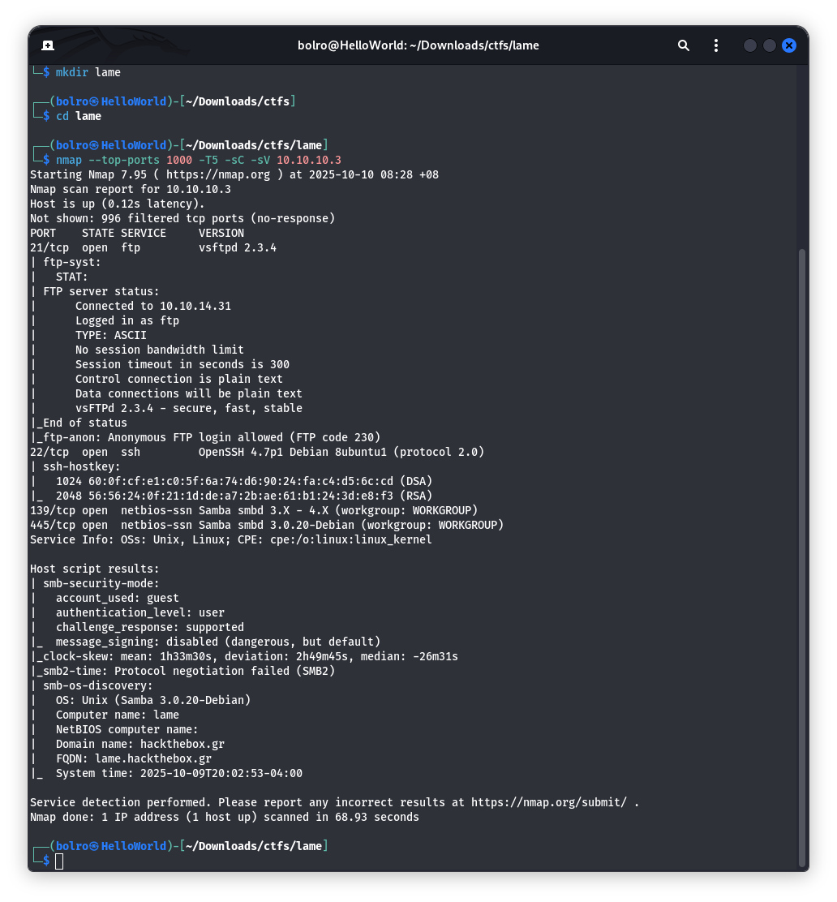

# Бие даалт – Тайлан

## Machine 14 — <Lame, IP:10.10.10.3>

### 1.) Nmap-аар шалгахад зорилтот сервер дээр vsFTPd 2.3.4, OpenSSH, мөн Samba ажиллаж байгааг илрүүлэв.

### 2.) FTP серверийг нэргүй нэвтрэлтийг зөвшөөрөхөөр тохируулсан байна. anonymous:anonymous итгэмжлэлээр холбогдоход жагсаах файл алга гэж харагдав.

### 3.)

### 4.)

### 5.) Эхлээд Metasploit консолыг ажиллуулна:

### 6.) SMB үйлчилгээг smbmap ашиглан нарийвчлан шалгана.

### 7.) Бид msfconsole-ийг дахин ажиллуулж, модулийг хайна:

### 8.) Зорилтот машины Samba үйлчилгээнд боломжит эксплойтууд байгаа эсэхийг шалгахын тулд searchsploit ашиглана.

### 8.) Бид эксплойтын тохиргооны параметрүүдийг жагсаана:

### 9.) Эцэст нь run командыг ажиллуулж эксплойтыг эхлүүлнэ.

