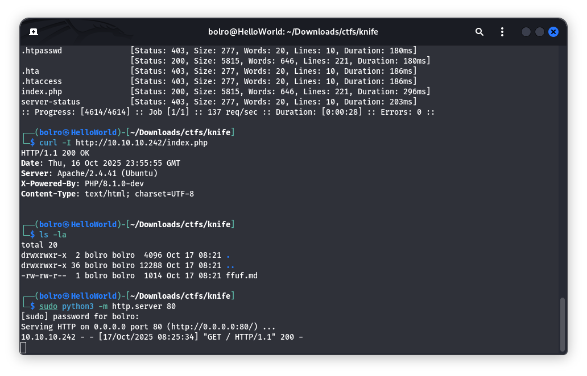

# Бие даалт – Тайлан

## Machine 16 — <Knife, IP:10.10.11.38>

### 1.) nmap-аар зорилтотыг скан хийхэд 2 нээлттэй порт байгааг харуулав.

### 2.) Вэб enum (Фолдер хайлт:)

### 3.) Header шалгах:

### 4.)

### 5.)

### 6.) Header шалгах:

### 7.) Reverse shell

### 8.) target machine интернетгүй байсан тул локалаар linepear ээр дамжуулсан.

### linstening хийсэн

### 9.) linPEAS бол Linux машин дээр эрх өсгөх (priv-esc) боломжуудыг автоматаар самнаж олж өгөх all-in-one скрипт.

### 10.) Vim ашигласан

### 11.) Дараа нь bash болгож

### 13.) Үүний дагуу рүүт эрхтэй болсон.

# Дүгнэлт

### Энэ машин дээрх нэвтрэлтийн үндсэн шалтгаан нь PHP 8.1.0-dev-ийн суурилуулсан backdoor (эрх мэдэлгүйгээр User-Agentt: zerodium... толгойгоор алсаас команд ажиллах) байв. Вэб сервер(HTTP)-ээс довтлогч реверс shell авч, james хэрэглэгчийн эрхээр системд орсон.

### Дараагийн шатанд sudoers буруу тохиргоо (james нь sudo /usr/bin/knife-ийг NOPASSWD-аар ажиллуулж чаддаг) ашиглагдаж, knife exec-ээр root руу шууд үсрэх боломж олгосон.

# Кибер тэсвэртэй байдлын зөвлөмж

## Эрхийн загвар (sudoers/least privilege)

### NOPASSWD арилгах: james-ын sudo /usr/bin/knife эрхийг устгах эсвэл зөвхөн аюулгүй, хязгаарлагдмал параметртэй wrapper скрипт рүү заах.
