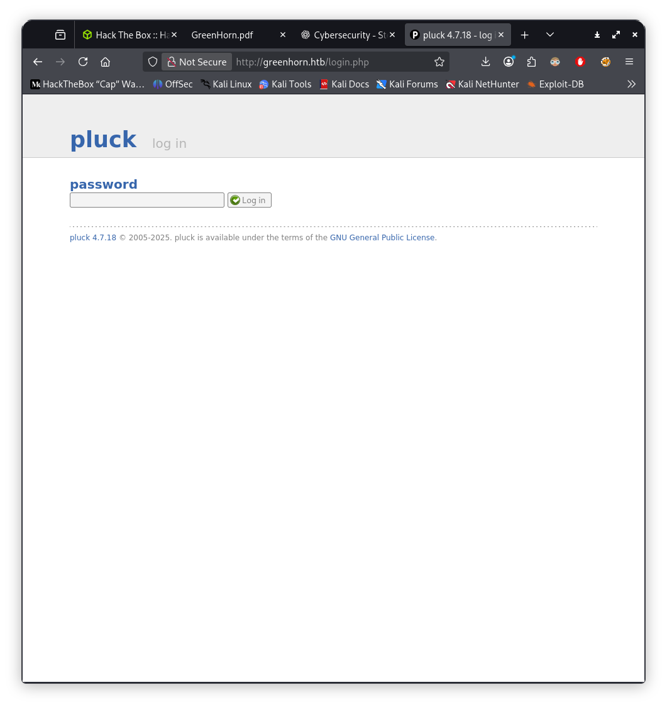

# Бие даалт – Тайлан

## Machine 18 — <PhotoBomb, IP:10.10.11.182>

### 1.)

### 2.)

### 3.)

### 4.)

### 5.)

### 6.)

### 7.)

### 8.)

### 9.)

### 10.)

# Дүгнэлт

### Эхний алдаа (Foothold): photobomb.htb-ийн эх кодоос (photobomb.js) plaintext итгэмжлэл (ph0t0:b0Mb!) ил байсан. Энэ нь /printer дотоод апп руу нэвтрэх боломж олгосон.

### sudo -l дээр (root) NOPASSWD: SETENV: /opt/cleanup.sh илэрсэн. cleanup.sh нь /opt/.bashrc-ийг уншиж, enable -n [-ээр builtin [-ийг идэвхгүй болгосон мөртлөө скрипт дотор бүтэн замгүй ([, find) тушаалуудыг дууддаг байв. PATH=/tmp:$PATH болгон /tmp/[ нэртэй хорт “тушаал” байршуулж root бүрхүүл авсан.

# Кибер тэсвэртэй байдлын зөвлөмж

### Client-side нууц үг хориглох: JS/CSS/HTML–д ямар ч plaintext credential бүү үлдээ. Токен/итгэмжлэлийг server-side session эсвэл secret manager-т хадгал.Нууц эргэлт (rotation): Ил болсон бол даруй хүчингүй болгож, шинэчил.
