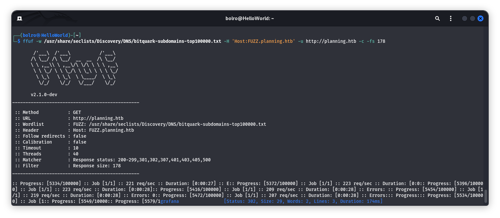

# Бие даалт – Тайлан

## Machine 02 — <Planning, IP:10.10.11.68>

## Энэ бүх даалгаваруудыг хийхээс өмнө target machine тай нэг сүлжээнд орох шаардлагатай.Тиймээс openvpn ашиглана нэг сүлжээнд байгаа юм шиг болгосон.

### 1) How many open TCP ports are listening on Planning?

    2

### 2) What subdomain of planning.htb hosts a data visualization monitoring platform?

    grafana.planning.htb

### 3) What version of Grafana is running on Planning?

    11.0.0

### 4) What password can be found in the docker container environment variables?

    RioTecRANDEntANT!

### 5) Submit the flag located in enzo's home directory.

    963c319c543e5ed8858ffab59dad8515

### 6) Which port on Planning is running another web application locally?

    8000

### 7) What is the full path of the database file for the web application?

    /opt/crontabs/crontab.db

### 8) What is the name of the web application running on port 8000?

    Crontab UI

### 9)Submit the flag located in root's home directory.

    Submit the flag located in the root user's home directory.
